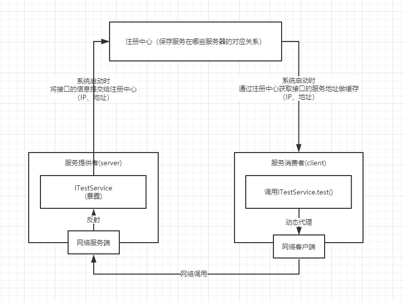
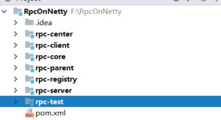

# 手写篇：如何手写RPC框架？

首先我们讲下什么是RPC？

RPC（Remote Procedure Call）远程过程调用协议，他是一种通过网络从远程计算机程序请求服务。简单的来说，就是通过网络进行远程执行，并返回结果。

像阿里的dubbo、谷歌的gRPC、facebook thrift等都是常见的rpc框架。

今天我们就试着手写一个简单的RPC框架，这样可以亲身体会其原理，也更容易让我们理解。

必要知识：netty入门、zookeeper入门

**首先我们先看下流程图**



为什么需要**注册中心**呢？首先我们得明白，我们是一个**分布式系统**，意味着有很多类似的服务，那我们进行远程调用的时候，并不知道需要对哪台服务器进行调用，这时我们引入注册中心，在服务提供者启动时，就将暴露的信息注册到注册中心，远程要进行调用时候，就只要去寻找注册中心，获取到服务器信息（地址、端口）就可以了。

### 定义网络协议

什么叫网络协议？官方的话可以这样讲：网络协议为计算机网络中进行数据交换而建立的规则、标准或约定的集合。简单的讲，就是我们指定一种规则， 然后以这种规则解析。

这里我们使用json格式做传输，主要是为了易于观看。

```json
{
  "identity":"interfaces=com.laofeizhu.rpc.test.producer.TestService&method=test&params=java.lang.String,com.laofeizhu.rpc.test.producer.TestBean",
  "params":{
     "java.lang.String":"test",
     "com.study.rpc.test.producer.TestBean":{
             "name":"老肥猪",
             "age":21
       }
   },
   "requestId":"1",
}
```

我们定义了以下格式进行解析，其中identity做为接口的唯一标识，requestId作为请求的唯一标识，params表示参数类型以及内容。

### 通讯

我们定义好了网络协议后要怎么进行通讯了，这里我们使用了现在比较火热的netty做通讯，使用他的原因，在于他有良好的并发、以及通俗易懂的api，可以大大减少我们的代码量。

### 整体项目结构



rpc-parent主要进行版本控制，rpc-core主要存放公用的代码，rpc-registy存放着注册中心的代码，rpc-client存放客户端代码（也就是存放服务消费者的代码），rpc-server主要存放服务端代码（也就是服务提供者的代码），rpc-center主要存放管理客户端和服务端的代码，rpc-test主要存放测试代码。

接下来我们先看下其pom文件依赖。

**rpc-parent**的pom文件依赖

```xml
<dependency>
    <groupId>io.netty</groupId>
    <artifactId>netty-all</artifactId>
    <version>4.1.32.Final</version>
</dependency>
<dependency>
    <groupId>org.projectlombok</groupId>
    <artifactId>lombok</artifactId>
    <version>1.18.0</version>
</dependency>
<dependency>
    <groupId>org.apache.curator</groupId>
    <artifactId>curator-recipes</artifactId>
    <version>2.3.0</version>
</dependency>
<dependency>
    <groupId>cn.hutool</groupId>
    <artifactId>hutool-all</artifactId>
    <version>4.3.1</version>
</dependency>
<dependency>
    <groupId>com.alibaba</groupId>
    <artifactId>fastjson</artifactId>
    <version>1.2.54</version>
</dependency>
<dependency>
    <groupId>org.slf4j</groupId>
    <artifactId>slf4j-api</artifactId>
    <version>1.7.25</version>
</dependency>
<dependency>
    <groupId>org.slf4j</groupId>
    <artifactId>slf4j-log4j12</artifactId>
    <version>1.7.25</version>
</dependency>
```

**rpc-core**的pom文件依赖

```xml
<dependency>
    <groupId>org.projectlombok</groupId>
    <artifactId>lombok</artifactId>
</dependency>
<dependency>
    <groupId>cn.hutool</groupId>
    <artifactId>hutool-all</artifactId>
</dependency>
<dependency>
    <groupId>com.alibaba</groupId>
    <artifactId>fastjson</artifactId>
</dependency>
<dependency>
   <groupId>io.netty</groupId>
   <artifactId>netty-all</artifactId>
</dependency>
<dependency>
    <groupId>org.slf4j</groupId>
    <artifactId>slf4j-api</artifactId>
    <version>1.7.25</version>
</dependency>
<dependency>
    <groupId>org.slf4j</groupId>
    <artifactId>slf4j-log4j12</artifactId>
    <version>1.7.25</version>
</dependency>
```

**rpc-register**的pom文件依赖

```xml
<dependency>
    <groupId>com.laofeizhu.rpc</groupId>
    <artifactId>rpc-core</artifactId>
    <version>1.0</version>
</dependency>
<dependency>
    <groupId>org.apache.curator</groupId>
    <artifactId>curator-recipes</artifactId>
</dependency>
```

**rpc-server**的pom文件依赖

```xml
<dependency>
    <groupId>com.laofeizhu.rpc</groupId>
    <artifactId>rpc-registry</artifactId>
    <version>1.0</version>
</dependency>
```

**rpc-client**的pom文件依赖

```xml
<dependency>
    <groupId>com.laofeizhu.rpc</groupId>
    <artifactId>rpc-registry</artifactId>
    <version>1.0</version>
</dependency>
```

**rpc-center**的pom文件依赖

```xml
<dependency>
    <groupId>com.laofeizhu.rpc</groupId>
    <artifactId>rpc-client</artifactId>
    <version>1.0</version>
</dependency>
<dependency>
    <groupId>com.laofeizhu.rpc</groupId>
    <artifactId>rpc-server</artifactId>
    <version>1.0</version>
</dependency>
```

**rpc-test**的pom文件依赖

```xml
<dependency>
    <groupId>com.laofeizhu.rpc</groupId>
    <artifactId>rpc-center</artifactId>
    <version>1.0</version>
</dependency>
```

## 代码示例

### 服务端代码（生产者端）

首先我们看下结构图


从图中我们可以看出，我们可以看到服务端代码要实现的是：1.将暴露的方法注册到注册中心 2.提供一个服务响应客户端的请求，并返回结果

首先我们先编写保存暴露接口的配置的类

```java
/**
 * @author 老肥猪
 * @since 2019/8/20
 */
@Data
public class ServiceConfig<T> {
    /**
     * 类型
     */
    private Class type;
    /**
     * 实例化对象
     */
    private T instance;

    public ServiceConfig(Class type, T instance) {
        this.type = type;
        this.instance = instance;
    }
}
```

首先我们编写rpc-center模块的代码作为入口

```java
public class ApplicationContext {
    //服务配置
    private List<ServiceConfig> serviceConfigs;
    //netty服务
    private NettyServer nettyServer;
    public ApplicationContext(String registryUrl, List<ServiceConfig> serviceConfigs, Interger port) {
        //保存暴露的接口
        this.serviceConfigs = serviceConfigs == null ? new ArrayList<>() : serviceConfigs;
        //实例化注册中心
        this.initRegistry(registryUrl);
        //将接口注册到注册中心，从注册中心获取接口，初始化服务接口列表
        InetAddress addr = InetAddress.getLocalHost();
        String hostname = addr.getHostName();
        String hostAddress = addr.getHostAddress();
        RegistryInfo registryInfo = new RegistryInfo(hostname, hostAddress, port);
        this.doRegistry(registryInfo);
        
         //初始化Netty服务器，接受到请求，直接达到服务提供者的service方法中。
        if (!this.serviceConfigs.isEmpty()) {
            nettyServer = new NettyServer(this.serviceConfigs, id2MethodMap);
            nettyServer.init(port);
        }
    }
}
```

就这样，我们初始化了我们即将要完成的步骤，接下来我们按照步骤走下去。

#### 1.实例化注册中心

这里我们对注册中心初始化，判断协议，创建不同的注册中心

```java
public class ApplicationContext {
    //注册中心
	private Registry registry;
    /**
     * 该方法仅仅支持zk注册中心
     *
     * @param registryUrl
     */
    private void initRegistry(String registryUrl) {
        if (registryUrl.startsWith("zookeeper://")) {
            //将前面的协议剔除
            registry = new ZkRegistry(registryUrl.substring(12));
        }
    }
}
```

#### 2.对类进行注册

这里我我们进行注册

```java
public class ApplicationContext {
    //注册中心
	private Registry registry;
    /**
     * 进行注册
     *
     * @param registryInfo
     * @throws Exception
     */
    private void doRegistry(RegistryInfo registryInfo) throws Exception {
        //初始化提供者的配置
        for (ServiceConfig config : serviceConfigs) {
            Class type = config.getType();
            registry.register(type, registryInfo);
            Method[] declaredMethods = type.getDeclaredMethods();
            for (Method method : declaredMethods) {
                String identify = Utils.buildIdentify(type, method);
                id2MethodMap.put(identify, method);
            }
        }
    }
}
```

这里我们在rpc-register创建接口Register.使用面向接口的方式提供了接口，为了后面可以拓展除了以zookeeper为基础的注册中心方案。

```java
/**
 * @author 老肥猪
 * @since 2019/8/19
 */
public interface Registry {
    void register(Class clazz,RegistryInfo registryInfo) throws Exception;
}

```

这里我们实现了Registry的接口方法，为了方便对zookeeper增删改查，我们引入Apache的Curator。注册的key通过工具类统一生成，大概长这样：“interfaces=com.laofeizhu.rpc.test.producer.TestService&method=test&params=java.lang.String,com.laofeizhu.rpc.test.producer.TestBean”

```java
/**
 * @author 老肥猪
 * @since 2019/8/19
 * zookeeper的注册中心
 */
public class ZkRegistry implements Registry {
    private CuratorFramework client;
    /**
     * 构造函数
     * @param connectString 连接字符串信息
     */
    public ZkRegistry(String connectString) {
        RetryPolicy retryPolicy = new ExponentialBackoffRetry(1000, 3);
        this.client = CuratorFrameworkFactory.newClient(connectString,retryPolicy);
        client.start();
        try {
            /**
             * 查看节点是否存在
             */
            Stat rpc = client.checkExists().forPath(RegistryConfig.RPC_PATH);
            //如果不存在就创建
            if(rpc==null) {
                client.create().creatingParentsIfNeeded().forPath(RegistryConfig.RPC_PATH);
            }
        } catch (Exception e) {
            log.error("zookeeper启动失败:["+e.getMessage()+"]",e);
        }
    }

    /**
     * 注册
     * @param clazz
     * @param registryInfo
     * @throws Exception
     */
    @Override
    public void register(Class clazz, RegistryInfo registryInfo) throws Exception {
        /**
         * 获取所有公共方法
         */
        Method[] declaredMethods = clazz.getDeclaredMethods();
        for (Method method : declaredMethods) {
            String key = Utils.buildIdentify(clazz,method);
            String path = RegistryConfig.RPC_PATH+"/"+key;
            Stat stat = client.checkExists().forPath(path);
            List<RegistryInfo> registryInfos;
            if(stat!=null) {
                byte[] bytes = client.getData().forPath(path);
                String data=new String(bytes,StandardCharsets.UTF_8);
                registryInfos = JSONArray.parseArray(data,RegistryInfo.class);
                if(registryInfos.contains(registryInfo)) {
                    //正常情况，在关闭连接的时候临时节点会自动删除，但是有时候重启后还是存在
                    log.info("注册中心，地址已经存在，路径为："+path);
                } else {
                    registryInfos.add(registryInfo);
                    client.setData().forPath(path, JSONObject.toJSONString(registryInfos).getBytes());
                }
            } else {
                registryInfos=new ArrayList<>();
                registryInfos.add(registryInfo);
                //创建临时节点
                client.create().creatingParentsIfNeeded()
                        .withMode(CreateMode.EPHEMERAL)
                        .forPath(path,JSONObject.toJSONString(registryInfos).getBytes());
            }
            log.info("注册到注册中心，路径为：["+path+"]信息为:"+registryInfo);
        }
    }
}
```

这是rpc-core下的工具类，下面是生成id的方法

```java
/**
 * @author 老肥猪
 * @since 2019/8/20
 */
public class Utils {

    /**
     * 构建唯一标识
     * @param clazz 类
     * @param method 方法
     * @return
     */
    public static String buildIdentify(Class clazz, Method method) {
        Map<String,String> map =new HashMap<>();
        map.put(MessageConstant.INTERFACES,clazz.getName());
        map.put(MessageConstant.METHOD,method.getName());
        Optional.ofNullable(method.getParameters()).ifPresent(parameters -> {
            if(parameters.length!=0) {
                StringBuilder sb=new StringBuilder();
                for (int i = 0; i < parameters.length; i++) {
                    sb.append(parameters[i].getType().getName());
                    if(i!=parameters.length-1) {
                        sb.append(",");
                    }
                }
                map.put(MessageConstant.PARAMS,sb.toString());
            }
        });
        return map2String(map);
    }

    /**
     * map转String
     * @param map
     * @return
     */
    public static String map2String(Map<String,String> map) {
        StringBuilder sb=new StringBuilder();
        map.forEach((k, v) -> {
            sb.append(k).append("=").append(v).append("&");
        });
        if(map.size()>0) {
            //删掉最后一个&
            sb.deleteCharAt(sb.length()-1);
        }
        return sb.toString();
    }

    /**
     * string转成map
     * @param str
     * @return
     */
    public static Map<String, String> string2Map(String str) {
        String[] split = str.split("&");
        Map<String, String> map = new HashMap<>(16);
        for (String s : split) {
            String[] split1 = s.split("=");
            map.put(split1[0], split1[1]);
        }
        return map;
    }
}

```

这样我们就成功的把类的方法以及所在服务器信息注册到了注册中心了

#### 3.初始化netty服务器

在rpc-server创建NettyServer类。这里我们初始化了netty服务器，并设置以”$$"字符串进行消息拆分。

```java
public class NettyServer {

    private RpcInvokeHandler rpcInvokeHandler;

    public NettyServer(List<ServiceConfig> serviceConfigs, Map<String, Method> id2MethodMap) {
        this.rpcInvokeHandler = new RpcInvokeHandler(serviceConfigs, id2MethodMap);
    }

    public void init(Integer port) throws InterruptedException {
        EventLoopGroup bossGroup = new NioEventLoopGroup();
        EventLoopGroup workerGroup = new NioEventLoopGroup();
        ServerBootstrap b = new ServerBootstrap();
        b.group(bossGroup, workerGroup)
                .channel(NioServerSocketChannel.class)
                .option(ChannelOption.SO_BACKLOG, 1024)
                .childHandler(new ChannelInitializer() {
                    @Override
                    protected void initChannel(Channel ch) {
                        //设置根据分隔符“$$”来拆分消息
                        ByteBuf delimiter = Unpooled.copiedBuffer("$$", Charset.forName("UTF-8"));
                        ch.pipeline().addLast(new DelimiterBasedFrameDecoder(1024 * 1024, delimiter));
                        ch.pipeline().addLast(new StringDecoder());
                        ch.pipeline().addLast().addLast(rpcInvokeHandler);
                    }
                });
        b.bind(port).sync();
        log.info("启动NettyServer成功,端口号为："+port);
    }

}
```

接下来我们看下RPC的执行者，在构造函数中我们将类和对应的实例放入map中便于待会进行操作。

```java
/**
 * @author 老肥猪
 * @since 2019/8/20
 */
@Slf4j(topic = "rpc-handler")
@ChannelHandler.Sharable
public class RpcInvokeHandler extends ChannelInboundHandlerAdapter {

    /**
     * id对应的方法
     */
    private Map<String, Method> id2MethodMap;

    /**
     * 接口对应的实现类
     */
    private Map<Class, Object> interfaces2Instance=new HashMap<>();

    /**
     * 线程池
     */
    private ThreadPoolExecutor threadPoolExecutor = new ThreadPoolExecutor(10, 50, 60,
            TimeUnit.SECONDS, new LinkedBlockingQueue<>(), new ThreadFactory() {
        AtomicInteger m = new AtomicInteger(0);

        @Override
        public Thread newThread(Runnable r) {
            return new Thread(r, "RPC-Handler-" + m.incrementAndGet());
        }
    });

    /**
     * 构造函数
     *
     * @param serviceConfigs
     * @param id2MethodMap
     */
    public RpcInvokeHandler(List<ServiceConfig> serviceConfigs, Map<String, Method> id2MethodMap) {
        this.id2MethodMap = id2MethodMap;
        for (ServiceConfig config : serviceConfigs) {
            interfaces2Instance.put(config.getType(), config.getInstance());
        }
    }

    /**
     * 读取信息
     * @param ctx
     * @param msg
     * @throws Exception
     */
    @Override
    public void channelRead(ChannelHandlerContext ctx, Object msg) throws Exception {
        try {
            String message = (String) msg;
            // 这里拿到的是一串JSON数据，解析为Request对象，
            log.info("接收到消息：" + msg);
            Request request = Request.parse(message, ctx);
            threadPoolExecutor.execute(new RpcInvokeTask(request));
        } finally {
            ReferenceCountUtil.release(msg);
        }
    }

    @Override
    public void channelReadComplete(ChannelHandlerContext ctx) throws Exception {
        ctx.flush();
    }

    @Override
    public void exceptionCaught(ChannelHandlerContext ctx, Throwable cause) throws Exception {
        log.error("服务端发生异常：" + cause.getMessage());
        ctx.close();
    }

    class RpcInvokeTask implements Runnable {
        private Request request;

        RpcInvokeTask(Request request) {
            this.request = request;
        }

        @Override
        public void run() {
            String identity = request.getIdentity();
            //方法名称
            Method method = id2MethodMap.get(identity);
            Map<String, String> map = Utils.string2Map(identity);
            //接口名称
            String interfacesName = map.get(MessageConstant.INTERFACES);
            //根据接口名称找到对应实现类
            Class interfacesClass;
            try {
                interfacesClass = Class.forName(interfacesName);
            } catch (ClassNotFoundException e) {
                log.error("找不到对应类：[" + e.getMessage() + "]", e);
                return;
            }
            //获取实例对象
            Object o = interfaces2Instance.get(interfacesClass);
            //获取方法的参数
            String paramsString = map.get(MessageConstant.PARAMS);
            //保存响应结果
            Object result;
            if (paramsString != null && !"".equals(paramsString)) {
                //参数拆分
                String[] paramTypeClasses = paramsString.split(",");
                Map<String, Object> paramsMap = request.getParamsMap();
                //参数实例化保存数组
                Object[] paramInstances = new Object[paramTypeClasses.length];
                for (int i = 0; i < paramTypeClasses.length; i++) {
                    String paramTypeClass = paramTypeClasses[i];
                    paramInstances[i] = paramsMap.get(paramTypeClass);
                }
                try {
                    result = method.invoke(o, paramInstances);
                } catch (Exception e) {
                    log.error("调用方法时发送异常：[" + e.getMessage() + "]", e);
                    return;
                }
            } else {
                try {
                    result = method.invoke(o);
                } catch (Exception e) {
                    log.error("调用方法时发送异常：[" + e.getMessage() + "]", e);
                    return;
                }
            }
            ChannelHandlerContext ctx = request.getCtx();
            String requestId = request.getRequestId();
            Response response = Response.create(JSONObject.toJSONString(result), identity, requestId);
            String msg = JSONObject.toJSONString(response) + "$$";
            ByteBuf byteBuf = Unpooled.copiedBuffer(msg.getBytes());
            //发送给客户端并刷新
            ctx.writeAndFlush(byteBuf);
            log.info("响应给客户端："+msg);
        }

    }


}

```

现在我们在rpc-core下，看下封装的Request类和Response类的方法

这是封装的**Request**请求，其中封装了将消息转成Request类的方法

```java
/**
 * @author 老肥猪
 * @since 2019/8/19
 */
@Data
public class Request {

    /**
     * id
     */
    private String identity;

    /**
     * 参数
     */
    private Map<String, Object> paramsMap;

    /**
     * 上下文
     */
    private ChannelHandlerContext ctx;

    /**
     * 请求id
     */
    private String requestId;

    /**
     * 获取Request
     * @param message 信息
     * @param ctx 上下文
     * @return
     * @throws ClassNotFoundException
     */
    public static Request parse(String message, ChannelHandlerContext ctx) throws ClassNotFoundException {
        /*
         * {
         *   "identity":"interfaces=com.laofeizhu.rpc.test.producer.TestService&method=test&params=java.lang.String,com.laofeizhu.rpc.test.producer.TestBean",
         *   "params":{
         *      "java.lang.String":"test",
         *      "com.study.rpc.test.producer.TestBean":{
         *              "name":"老肥猪",
         *              "age":21
         *        }
         *    },
         *    "requestId":"1"
         * }
         */
        JSONObject json = JSONObject.parseObject(message);
        String identity = json.getString(MessageConstant.IDENTITY);
        JSONObject params = json.getJSONObject(MessageConstant.PARAMS);
        Set<String> strings = params.keySet();
        Map<String,Object> map=new HashMap<>();
        for (String key : strings) {
            //对常见的类型指定类型值
            switch (key) {
                case "java.lang.String":
                    map.put(key, params.getString(key));
                    break;
                case "java.lang.Integer":
                    map.put(key, params.getIntValue(key));
                    break;
                case "java.lang.Long":
                    map.put(key, params.getLongValue(key));
                    break;
                default:
                    Class clazz = Class.forName(key);
                    Object obj = params.getObject(key, clazz);
                    map.put(key, obj);
                    break;
            }
        }
        Request request=new Request();
        request.setIdentity(identity);
        request.setCtx(ctx);
        request.setRequestId(json.getString(MessageConstant.REQUEST_ID));
        request.setParamsMap(map);
        return request;
    }

}
```

下面是封装的**Response**类，同样的，提供了Response的生成方法

```java
/**
 * @author 老肥猪
 * @since 2019/8/20
 */
@Data
public class Response {
    private String result;
    private String identify;
    private String requestId;

    public static Response create(String result, String identify, String requestId) {
        Response response = new Response();
        response.setResult(result);
        response.setIdentify(identify);
        response.setRequestId(requestId);
        return response;
    }
}
```

就是这么简单，我们实现了服务提供者的注册以及响应。

### 客户端代码（消费端）

我们再看下结构图


可以看出我们客户端的代码（消费端）其实很简单，我们可以分成：1.需要实现的就是将自己需要调用的方法从注册中心获取调用的服务信息缓存到本地。2.使用动态代理实现调用。两部分去实现。

那么下面我们用代码来实现它。

首先我们在ApplicationContext添加方法，实现拉取注册的功能。

引用配置类

```java
/**
 * @author 老肥猪
 * @since 2019/8/20
 */
@Data
public class ReferenceConfig {

    private Class type;

    public ReferenceConfig(Class type) {
        this.type = type;
    }
}
```

初始化引用的配置

```java
@Slf4j(topic = "application-context")
public class ApplicationContext {
    /**
     * @param registryUrl      注册地址
     * @param serviceConfigs   服务配置
     * @param referenceConfigs 引用配置
     * @param port             端口
     * @throws Exception
     */
    public ApplicationContext(String registryUrl, List<ServiceConfig> serviceConfigs, List<ReferenceConfig> referenceConfigs, Integer port) throws Exception {
        //保存暴露的接口
        this.serviceConfigs = serviceConfigs == null ? new ArrayList<>() : serviceConfigs;
        //引用方法配置
        this.referenceConfigs = referenceConfigs == null ? new ArrayList<>() : referenceConfigs;
        //实例化注册中心
        this.initRegistry(registryUrl);

        //将接口注册到注册中心，从注册中心获取接口，初始化服务接口列表
        InetAddress addr = InetAddress.getLocalHost();
        String hostname = addr.getHostName();
        String hostAddress = addr.getHostAddress();
        RegistryInfo registryInfo = new RegistryInfo(hostname, hostAddress, port);
        this.doRegistry(registryInfo);

        //初始化Netty服务器，接受到请求，直接达到服务提供者的service方法中。
        if (!this.serviceConfigs.isEmpty()) {
            nettyServer = new NettyServer(this.serviceConfigs, id2MethodMap);
            nettyServer.init(port);
        }
        
    }
    /**
     * 进行注册
     *
     * @param registryInfo
     * @throws Exception
     */
    private void doRegistry(RegistryInfo registryInfo) throws Exception {
        //初始化提供者的配置
        for (ServiceConfig config : serviceConfigs) {
            Class type = config.getType();
            registry.register(type, registryInfo);
            Method[] declaredMethods = type.getDeclaredMethods();
            for (Method method : declaredMethods) {
                String identify = Utils.buildIdentify(type, method);
                id2MethodMap.put(identify, method);
            }
        }
        //初始化引用配置
        for (ReferenceConfig config : referenceConfigs) {
            Class type = config.getType();
            List<RegistryInfo> registryInfos = registry.getRegistry(type);
            if (registryInfos != null && registryInfos.size() > 0) {
                //这里是为了快速拿到注册机信息，但是有问题：需加入Watch机制，发现新节点加入的时候，对这个map做刷新
                registryMap.put(type, registryInfos);
                this.initChannel(registryInfos);
            }
        }
    }
    
    /**
     * 初始化通道
     *
     * @param registryInfos
     */
    private void initChannel(List<RegistryInfo> registryInfos) {
        for (RegistryInfo registryInfo : registryInfos) {
            if (!channels.containsKey(registryInfo)) {
                log.info("开始建立连接：" + registryInfo.getIp() + ":" + registryInfo.getPort());
                NettyClient client = new NettyClient(registryInfo.getIp(), registryInfo.getPort());
                //将
                client.setMessageCallback(msg -> {
                    Response response = JSONObject.parseObject(msg, Response.class);
                    try {
                        responses.put(response);
                    } catch (InterruptedException e) {
                        log.error("放入返回值队列失败：[" + e.getMessage() + "]", e);
                    }
                });
                //获取连接
                ChannelHandlerContext ctx = client.getCtx();
                channels.put(registryInfo, ctx);
            }
        }
    }
}
```

这里我们增加了两部分代码，第一部分是从从注册中心获取到所有暴露了该接口方法的服务信息（多个服务信息，表示启动了多台相同的服务，这里待会会引入负载均衡的概念），第二部分是初始化通道（通讯管道），为不同服务建立不同的通道，这里我们以服务信息做key，通道做value建立map，并把消息压入队列等待消费。

```java
//初始化引用配置
for (ReferenceConfig config : referenceConfigs) {
    Class type = config.getType();
    List<RegistryInfo> registryInfos = registry.getRegistry(type);
    if (registryInfos != null && registryInfos.size() > 0) {
        //这里是为了快速拿到注册机信息，但是有问题：需加入Watch机制，发现新节点加入的时候，对这个map做刷新
        registryMap.put(type, registryInfos);
        this.initChannel(registryInfos);
    }
}
```

```java
/**
 * 初始化通道
 *
 * @param registryInfos
 */
private void initChannel(List<RegistryInfo> registryInfos) {
    for (RegistryInfo registryInfo : registryInfos) {
        if (!channels.containsKey(registryInfo)) {
            log.info("开始建立连接：" + registryInfo.getIp() + ":" + registryInfo.getPort());
            NettyClient client = new NettyClient(registryInfo.getIp(), registryInfo.getPort());
            //将
            client.setMessageCallback(msg -> {
                Response response = JSONObject.parseObject(msg, Response.class);
                try {
                    responses.put(response);
                } catch (InterruptedException e) {
                    log.error("放入返回值队列失败：[" + e.getMessage() + "]", e);
                }
            });
            //获取连接
            ChannelHandlerContext ctx = client.getCtx();
            channels.put(registryInfo, ctx);
        }
    }
}
```

下面我们看NettyClient类，该类监听了NettyServer发送过来的消息，并提供setMessageCallback方法，提供设置回调值接口。

```java
/**
 * @author 老肥猪
 * @since 2019/8/21
 */
@Slf4j(topic = "netty-client")
public class NettyClient {

    @Setter
    private MessageCallback messageCallback;

    private final CountDownLatch countDownLatch = new CountDownLatch(1);

    private ChannelHandlerContext ctx;

    public NettyClient(String ip, Integer port) {
        EventLoopGroup group = new NioEventLoopGroup();
        try {
            Bootstrap b = new Bootstrap();
            b.group(group)
                    .channel(NioSocketChannel.class)
                    .handler(new ChannelInitializer<SocketChannel>() {
                        @Override
                        protected void initChannel(SocketChannel channel) throws Exception {
                            ByteBuf delimiter = Unpooled.copiedBuffer("$$".getBytes());
                            channel.pipeline().addLast(new DelimiterBasedFrameDecoder(1024 * 1024, delimiter));
                            channel.pipeline().addLast(new StringDecoder());
                            channel.pipeline().addLast(new NettyClientHandler());
                        }
                    });
            b.connect(ip, port).sync();
        } catch (Exception e) {
            log.error("客户端连接异常：[" + e.getMessage() + "]", e);
        }
    }

    public ChannelHandlerContext getCtx() {
        try {
            countDownLatch.await();
        } catch (InterruptedException e) {
            log.error("客户端等待发生异常[" + e.getMessage() + "]", e);
        }
        return this.ctx;
    }

    public interface MessageCallback {
        void onMessage(String message);
    }

    public class NettyClientHandler extends ChannelInboundHandlerAdapter {
        /**
         * 读取信息
         * @param ctx
         * @param msg
         * @throws Exception
         */
        @Override
        public void channelRead(ChannelHandlerContext ctx, Object msg) throws Exception {
            try {
                String message = (String) msg;
                if (messageCallback != null) {
                    messageCallback.onMessage(message);
                }
            } finally {
                ReferenceCountUtil.release(msg);
            }
        }

        @Override
        public void channelActive(ChannelHandlerContext ctx) throws Exception {
            NettyClient.this.ctx = ctx;
            log.info("客户端连接成功：" + ctx);
            countDownLatch.countDown();
        }

        @Override
        public void channelReadComplete(ChannelHandlerContext ctx) throws Exception {
            ctx.flush();
        }

        /**
         * 出现异常
         * @param ctx
         * @param cause
         * @throws Exception
         */
        @Override
        public void exceptionCaught(ChannelHandlerContext ctx, Throwable cause) throws Exception {
            ctx.close();
            log.error("客户端发生异常：" + cause.getMessage());
        }
    }
}
```


#### 1.从注册中心获取注册的服务信息

接下来我们看下register.getRegistrys()方法，就这样我们从zk获取到了注册服务的信息。

```java
/**
 * @author 老肥猪
 * @since 2019/8/19
 */
public interface Registry {
    void register(Class clazz,RegistryInfo registryInfo) throws Exception;

    List<RegistryInfo> getRegistry(Class type) throws Exception;
}
```

```java
/**
 * @author 老肥猪
 * @since 2019/8/19
 * zookeeper的注册中心
 */
@Slf4j(topic = "Zk-Registry")
public class ZkRegistry implements Registry {

    private CuratorFramework client;

    /**
     * 获得注册信息
     * @param type
     * @return
     */
    @Override
    public List<RegistryInfo> getRegistry(Class type) throws Exception {
        Method[] methods = type.getDeclaredMethods();
        List<RegistryInfo> registryInfos = null;
        for (Method method : methods) {
            String key = Utils.buildIdentify(type,method);
            String path = RegistryConfig.RPC_PATH+"/"+key;
            Stat stat = client.checkExists().forPath(path);
            if(stat==null) {
                log.warn("找不到注册信息，路径为：["+path+"]");
                continue;
            }
            if(null == registryInfos) {
                byte[] bytes = client.getData().forPath(path);
                String data = new String(bytes,StandardCharsets.UTF_8);
                registryInfos = JSONArray.parseArray(data,RegistryInfo.class);
                if(registryInfos!=null && registryInfos.size()>0) {
                    break;
                }
            }
        }
        return registryInfos;
    }
}
```

#### 2.使用动态代理实现调用

这里我们使用动态代理来代理接口类的。

```java
/**
 * @author 老肥猪
 * @since 2019/8/20
 * 上下文
 */
@Slf4j(topic = "application-context")
public class ApplicationContext {
    @SuppressWarnings("unchecked")
	public <T> T getService(Class<T> clazz) {
        return (T) Proxy.newProxyInstance(ClassLoader.getSystemClassLoader(), new Class[]{clazz}, (Object proxy, Method method, 
            String methodName = method.getName();
            if ("equals".equals(methodName) || "hasCode".equals(methodName)) {
                throw new IllegalAccessException("不能访问" + methodName + "方法");
            }
            if ("toString".equals(methodName)) {
                return clazz.getName() + "#" + methodName;
            }
            //获取负载选择的机器
            List<RegistryInfo> registryInfos = registryMap.get(clazz);
            RegistryInfo registryInfo = loadBalancer.choose(registryInfos);
            //获取到它的上下文
            ChannelHandlerContext channelHandlerContext = channels.get(registryInfo);
            //获取id
            String identify = Utils.buildIdentify(clazz, method);
            requestIdWorker.increment();
            String requestId = String.valueOf(requestIdWorker.longValue());
            Invoker invoker = new DefaultInvoker(identify, requestId, channelHandlerContext, method.getReturnType());
            invokerMap.put(identify + ":" + requestId, invoker);
            return invoker.invoker(args);
   		});
    }
}
```

其中关键点的在于Invoker接口类，这里我们自己实现了invoker接口，将读取到的消息进行转化返回。

```java
/**
 * @author 老肥猪
 * @since 2019/8/21
 */
public interface Invoker<T> {
    T invoker(Object[] args);
    void setResult(String result);
}
```

```java
/**
 * @author 老肥猪
 * @since 2019/8/21
 */
@Slf4j(topic = "invoker")
public class DefaultInvoker<T> implements Invoker {

    private String identify;
    private String requestId;
    private ChannelHandlerContext ctx;
    private Class resturnType;
    private CountDownLatch downLatch=new CountDownLatch(1);
    private T result;

    public DefaultInvoker(String identify, String requestId, ChannelHandlerContext ctx, Class resturnType) {
        this.identify = identify;
        this.requestId = requestId;
        this.ctx = ctx;
        this.resturnType = resturnType;
    }

    @Override
    public T invoker(Object[] args) {
        /*
         * {
         *   "identity":"interfaces=com.laofeizhu.rpc.test.producer.TestService&method=test&params=java.lang.String,com.laofeizhu.rpc.test.producer.TestBean",
         *   "params":{
         *      "java.lang.String":"test",
         *      "com.study.rpc.test.producer.TestBean":{
         *              "name":"老肥猪",
         *              "age":21
         *        }
         *    },
         *    "requestId":"1",
         * }
         */
        JSONObject json=new JSONObject();
        json.put(MessageConstant.IDENTITY,this.identify) ;
        json.put(MessageConstant.REQUEST_ID,this.requestId) ;
        JSONObject param=new JSONObject();
        if(args!=null) {
            for (Object arg : args) {
                param.put(arg.getClass().getName(),arg);
            }
        }
        json.put(MessageConstant.PARAMS,param);
        log.info("发送一条信息给服务端，信息内容为：["+json.toString()+"]");
        String msg = json.toString()+"$$";//$$是我们定义的消息分隔符
        ByteBuf byteBuf = Unpooled.buffer(msg.getBytes().length);
        byteBuf.writeBytes(msg.getBytes());
        this.ctx.writeAndFlush(byteBuf);
        this.waitResult();
        return this.result;
    }

    @Override
    public void setResult(String result) {
        Object o = JSONObject.parseObject(result, this.resturnType);
        this.result = (T)o;
        downLatch.countDown();
    }

    private void waitResult() {
        try {
            downLatch.await();
        } catch (InterruptedException e) {
            log.error("等待返回结果异常：["+e.getMessage()+"]",e);
        }
    }
}

```

waitResult()用于等待setResult，保证返回值不为空。

上面我们如果认真看是否会发现多了一个东西LoadBalancer，这里的意思是负载的意思，我们获取到了多台同样服务的机器，我们只需要选择其中一台调用就可以了，而选择哪一台是否可以根据负载均衡来设置？答案显然，肯定可以，接下来我们看下LoadBalancer这个接口类。

```java
/**
 * @author 老肥猪
 * @since 2019/8/21
 */
public interface LoadBalancer {
    RegistryInfo choose(List<RegistryInfo> registryInfoList);
}
```

下面由于时间原因，没有写负载均衡的配置，我们简单使用随机数实现。

```java
/**
 * @author 老肥猪
 * @since 2019/8/21
 */
public class RandomBalancer implements LoadBalancer {
    @Override
    public RegistryInfo choose(List<RegistryInfo> registryInfoList) {
        return registryInfoList.get(RandomUtil.randomInt(0,registryInfoList.size()));
    }
}
```

这里我把它加入构造器

```java
public ApplicationContext(String registryUrl, List<ServiceConfig> serviceConfigs, List<ReferenceConfig> referenceConfigs, Integer port, LoadBalancer loadBalancer) throws Exception {
    //添加负载方式
    this.loadBalancer = loadBalancer;
}
```

现在写完了吗？答案肯定是不是，聪明的人也发现了Invoker的setResult方法由谁来调用呢？

其实这里由部分线程将Response压入队列这个方案，不难想出我们后面要怎么做，这样的方式其实是很常见的消费者生产模型，下面我们看代码。

```java
public ApplicationContext(String registryUrl, List<ServiceConfig> serviceConfigs, List<ReferenceConfig> referenceConfigs, Integer port, LoadBalancer loadBalancer) throws Exception {
    //启动线程消费消息
	this.initProcessor();
}
```

```java
/**
 * 初始化处理者，该处理着处理返回值，并把返回值反到对应的调用者的结果中，并唤醒调用者
 */
private void initProcessor() {
    int num = PROCESSOR_SIZE;
    ExecutorService executor = Executors.newFixedThreadPool(3);
    for (int i = 0; i < num; i++) {
        executor.submit(() -> {
            for (; ;) {
                Response response = responses.take();
                log.info("获取到返回数据：["+response+"]");
                String identify = response.getIdentify();
                String requestId = response.getRequestId();
                String key = identify + ":" + requestId;
                Invoker invoker = invokerMap.get(key);
                invoker.setResult(response.getResult());
            }
        });
    }
}
```

这里我们怎样确定唯一性？那就是id+requestId，这里的invokerMap在我们动态代理的时候就已经放入了信息了，这样我们拿到了对应的inoker并把对应的Response的结果放在setResult方法里面，回忆下setResult方法，当我们setResult后对应的等待线程会被唤醒，并返回结果。

```java
@Override
public void setResult(String result) {
    Object o = JSONObject.parseObject(result, this.resturnType);
    this.result = (T)o;
    downLatch.countDown();
}
```

```java
@Override
public T invoker(Object[] args) {
	......
    this.waitResult();
    return this.result;
}
```

```java
private void waitResult() {
    try {
        downLatch.await();
    } catch (InterruptedException e) {
        log.error("等待返回结果异常：["+e.getMessage()+"]",e);
    }
}
```

这样我们整套框架编写完成，接下来我们编写测试方法

服务端测试类（生产端）

```java
/**
 * @author 老肥猪
 * @since 2019/8/21
 */
public class TestProducer {
    public static void  main (String[] args) throws Exception {
        TestService testService = new TestService();
        ServiceConfig serviceConfig=new ServiceConfig<ITestService>(ITestService.class,testService);
        String registerUrl="zookeeper://127.0.0.1:2181,127.0.0.1:2182,127.0.0.1:2183";
        ApplicationContext ctx=new ApplicationContext(registerUrl,Collections.singletonList(serviceConfig),null,51555);
    }
}
```

日志

```log
2019-08-22 00:47:06 [mainhread] [INFO] - 注册到注册中心，路径为：[/testRPC/interfaces=com.laofeizhu.rpc.test.ITestService&method=test&params=com.laofeizhu.rpc.test.TestBean,java.lang.String]信息为:RegistryInfo(hostName=DESKTOP-CMSKE58, ip=192.168.25.1, port=51555) 
2019-08-22 00:47:07 [mainhread] [INFO] - 启动NettyServer成功,端口号为：51555 
2019-08-22 00:47:35 [nioEventLoopGroup-3-1hread] [INFO] - 接收到消息：{"identity":"interfaces=com.laofeizhu.rpc.test.ITestService&method=test&params=com.laofeizhu.rpc.test.TestBean,java.lang.String","requestId":"1","params":{"java.lang.String":"你好啊","com.laofeizhu.rpc.test.TestBean":{"age":18,"name":"laofeizhu"}}} 
2019-08-22 00:47:36 [RPC-Handler-1hread] [INFO] - 响应给客户端：{"identify":"interfaces=com.laofeizhu.rpc.test.ITestService&method=test&params=com.laofeizhu.rpc.test.TestBean,java.lang.String","requestId":"1","result":"\"TestBean(name=laofeizhu, age=18):你好啊\""}$$ 
```

客户端测试类（消费端）

```java
/**
 * @author 老肥猪
 * @since 2019/8/21
 */
public class TestConsumer {

    public static void  main (String[] args) throws Exception {
        ReferenceConfig serviceConfig=new ReferenceConfig(ITestService.class);
        String registerUrl="zookeeper://127.0.0.1:2181,127.0.0.1:2182,127.0.0.1:2183";
        ApplicationContext ctx=new ApplicationContext(registerUrl,null,Collections.singletonList(serviceConfig),51555);
        ITestService service = ctx.getService(ITestService.class);
        String test = service.test(new TestBean("laofeizhu", 18), "你好啊");
        System.out.println(test);
        Runtime.getRuntime().exit(0);
    }
}
```

日志

```log
2019-08-22 00:47:34 [mainhread] [INFO] - 开始建立连接：192.168.25.1:51555 
2019-08-22 00:47:35 [nioEventLoopGroup-2-1hread] [INFO] - 客户端连接成功：ChannelHandlerContext(NettyClient$NettyClientHandler#0, [id: 0x5458d440, L:/192.168.25.1:1095 - R:/192.168.25.1:51555]) 
2019-08-22 00:47:35 [mainhread] [INFO] - 发送一条信息给服务端，信息内容为：[{"identity":"interfaces=com.laofeizhu.rpc.test.ITestService&method=test&params=com.laofeizhu.rpc.test.TestBean,java.lang.String","requestId":"1","params":{"java.lang.String":"你好啊","com.laofeizhu.rpc.test.TestBean":{"age":18,"name":"laofeizhu"}}}] 
2019-08-22 00:47:36 [pool-3-thread-1hread] [INFO] - 获取到返回数据：[Response(result="TestBean(name=laofeizhu, age=18):你好啊", identify=interfaces=com.laofeizhu.rpc.test.ITestService&method=test&params=com.laofeizhu.rpc.test.TestBean,java.lang.String, requestId=1)] 
TestBean(name=laofeizhu, age=18):你好啊
```

## 总结

就这样我们简单的实现了一个RPC框架，实现完后，是否发现我们对这种模式更加的清晰了呢？其实每种东西想去更了解它，那就是翻它的源代码，然后实现一个简易版，这样有助于你更了解它，出错了也能知道问题所在，二次开发也变得更加的轻松。

