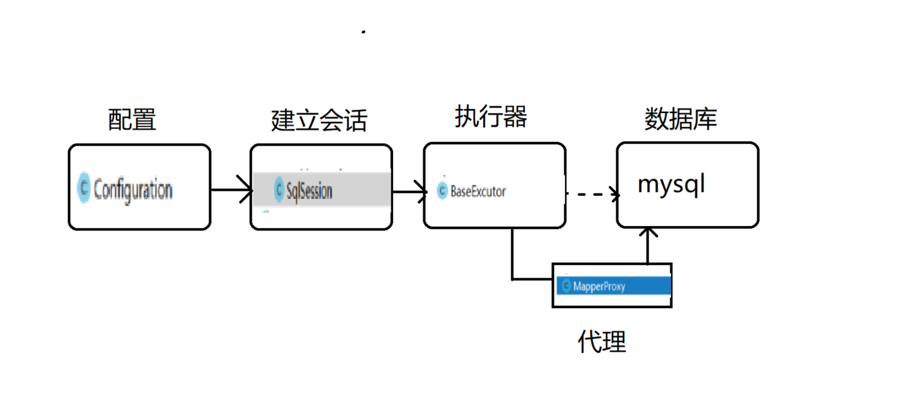

# mybatis 的简单实现原理解析
### 简介：
##### 一.整体架构   

##### 二.工程目录

##### 三.主要实现   
###### 1.使用动态代理将接口动态代理到xml的id和接口方法名相同的sql上，执行sql返回值    
###### 2.使用dom4j读取配置文件
##### 四.代码实现
###### 1.Configuration(读取配置文件类,包括数据库配置文件，以及*Mapper.xml文件的实现，并封装成一个对象)
```
/**
 * @author 老肥猪
 * @since 2019/3/7
 */
public class Configuration {
    private static ClassLoader loader = ClassLoader.getSystemClassLoader();

    /**
     * 资源读取以及构建
     *
     * @param resources
     * @return
     */
    public static Connection build(String resources) {
        try {
            InputStream inputStream = loader.getResourceAsStream(resources);
            SAXReader reader = new SAXReader();
            Document document = reader.read(inputStream);
            Element root = document.getRootElement();
            return evalDataSource(root);
        } catch (DocumentException e) {
            throw new RuntimeException("xml read error");
        } catch (ClassNotFoundException e) {
            throw new RuntimeException("not found driver");
        }
    }

    /**
     * 获取数据库的连接
     *  <database>
     *   <property name="driverClassName">com.mysql.jdbc.Driver</property>
     *   <property name="url">jdbc:mysql://localhost:3306/test?useUnicode=true&amp;characterEncoding=utf8&amp;tinyInt1isBit=false&amp;useSSL=false</property>
     *   <property name="username">root</property>
     *   <property name="password">88105156</property>
     *  </database>
     * @param node xml的节点
     * @return
     * @throws ClassNotFoundException
     */
    private static Connection evalDataSource(Element node) throws ClassNotFoundException {
        if (!node.getName().equals("database")) {
            throw new RuntimeException("root shuold be database");
        }
        String driver = null;
        String url = null;
        String username = null;
        String password = null;
        for (Object item : node.elements("property")) {
            Element element = (Element) item;
            String value = getValue(element);
            String name = element.attributeValue("name");
            if (name == null || value == null) {
                throw new RuntimeException("the database's value or database's name is not null");
            }
            switch (name) {
                case "url":
                    url = value;
                    break;
                case "username":
                    username = value;
                    break;
                case "driverClassName":
                    driver = value;
                    break;
                case "password":
                    password = value;
                    break;
                default:
                    throw new RuntimeException("not found name is " + name);
            }
        }
        Class.forName(driver);
        Connection connection = null;
        try {
            connection = DriverManager.getConnection(url, username, password);
        } catch (SQLException e) {
            e.printStackTrace();
        }
        return connection;
    }

    /**
     * 获得值
     *
     * @param element
     * @return
     */
    private static String getValue(Element element) {
        /**
         * 中间是否有值，有的话去找中间的，没有的话去找属性为value的值
         */
        return element.hasContent() ? element.getText() : element.attributeValue("value");
    }

    /**
     * 读取mapper的xml
     *  <mapper  namespace="com.test.mybatis.mapper.UserMapper">
     *     <select id="getUserById" resultType ="com.test.mybatis.bean.User">
     *         select * from user where id = ? (element.getText())
     *     </select>
     *  </mapper>
     * @param path 位置
     * @return
     */
    public static MapperBean readMapper(String path) {
        MapperBean mapperBean = new MapperBean();
        /**
         * 获得读取流
         */
        InputStream stream = loader.getResourceAsStream(path);
        SAXReader reader = new SAXReader();
        Document document = null;
        try {
            /**
             * 读取xml文档
             */
            document = reader.read(stream);
        } catch (DocumentException e) {
            throw new RuntimeException("read xml error");
        }
        /**
         * 获得xml文档根元素
         */
        Element root = document.getRootElement();
        if (root == null) {
            throw new RuntimeException("not found root element");
        }
        if (!root.getName().equals("mapper")) {
            throw new RuntimeException("root element should be mapper");
        }
        String namespace = root.attributeValue("namespace");
        if (namespace == null || "".equals(namespace)) {
            throw new RuntimeException("root element should be mapper");
        }
        /**
         * 设置扫描的类
         */
        mapperBean.setNamespace(namespace);
        List<Function> list = new ArrayList<>();
        root.elements().forEach(o -> {
            Function function = new Function();
            Element element = (Element) o;
            //设置类别 update || select || delete
            function.setSqlType(element.getName().trim());
            String funcName = element.attributeValue("id");
            if (funcName == null || "".equals(funcName)) {
                throw new RuntimeException("id is not be null");
            }
            function.setFuncName(funcName.trim());
            String resultType = element.attributeValue("resultType");
            if (resultType == null || "".equals(resultType)) {
                throw new RuntimeException("resultType is not be null");
            }
            resultType = resultType.trim();
            if (!element.hasContent()) {
                throw new RuntimeException("element's mid is not be null");
            }
            /**
             * 获得中间的sql
             */
            String sql = element.getText();
            function.setSql(sql);
            Object instance = null;
            try {
                instance = Class.forName(resultType).newInstance();
            } catch (ClassNotFoundException e) {
                e.printStackTrace();
            } catch (IllegalAccessException e) {
                e.printStackTrace();
            } catch (InstantiationException e) {
                e.printStackTrace();
            }
            function.setResultType(instance);
            list.add(function);
        });
        mapperBean.setList(list);
        return mapperBean;
    }
}
```
##### 2.DatabasePool（数据库连接池）
```
/**
 * @author 老肥猪
 * @since 2019/3/7
 */
public class DatabasePool {
    /**
     * 初始化连接数
     */
    private static final int INIT_LINK = 5;

    private static final int MAX_LINK = 20;

    private AtomicBoolean atomicBoolean = new AtomicBoolean(false);


    /**
     * 连接池队列
     */
    private static ArrayBlockingQueue<Connection> arrayBlockingQueue;

    static {
        arrayBlockingQueue = new ArrayBlockingQueue<>(INIT_LINK);
        for (int i = 0; i < INIT_LINK; i++) {
            arrayBlockingQueue.offer(Configuration.build("database.xml"));
        }
    }

    private synchronized void extend() {
        if (arrayBlockingQueue.size() <= 20) {
            int extendNum = INIT_LINK;
            if (arrayBlockingQueue.size() > MAX_LINK - INIT_LINK) {
                extendNum = MAX_LINK - INIT_LINK;
            }
            for (int i = 0; i < extendNum; i++) {
                arrayBlockingQueue.offer(Configuration.build("database.xml"));
            }
        }
    }

    /**
     * 内部类实现单例
     */
    private static class SingletonHolder {
        private static final DatabasePool INSTANCE = new DatabasePool();
    }

    /**
     * 获得一个数据库连接池
     *
     * @return
     */
    public static DatabasePool getDatabasePool() {
        return SingletonHolder.INSTANCE;
    }

    /**
     * 获得实例
     * @return
     * @throws InterruptedException
     */
    public synchronized Connection getConnection() throws InterruptedException {
        if (arrayBlockingQueue.isEmpty()) {
            if (arrayBlockingQueue.size() <= MAX_LINK) {
                extend();
                return arrayBlockingQueue.poll();
            } else {
                atomicBoolean.set(true);
                while (atomicBoolean.get()) {
                    this.wait();
                }
                return arrayBlockingQueue.poll();
            }
        } else {
            return arrayBlockingQueue.poll();
        }
    }

    /**
     * 回收
     * @param connection
     * @return
     */
    public synchronized void recycle(Connection connection) {
        if(arrayBlockingQueue.size()>=MAX_LINK) {
            atomicBoolean.set(false);
            this.notifyAll();
        } else {
            arrayBlockingQueue.offer(connection);
        }
    }

}

```

##### 3.MapperBean（存放配置包名，及配置的sql方法）
```
/**
 * @author 老肥猪
 * @since 2019/3/7
 */
@Data
public class MapperBean {
    private String namespace;
    private List<Function> list;
}
```
##### 4.Function(存放xml里的sql方法，包括，sql，以及返回值，以及查询类别，以及方法名)
```
/**
 * @author 老肥猪
 * @since 2019/3/7
 */
@Data
public class Function {
    private String sqlType;
    private String funcName;
    private String sql;
    private Object resultType;
    private String parameterType;
}
```
##### 5.Excutor(执行器的抽象方法)
```
/**
 * @author 老肥猪
 * @since 2019/3/7
 */
public abstract class Excutor {
    /**
     * 查询
     * @param sql
     * @param parameter
     * @param <T>
     * @return
     */
    public abstract <T> T queryOne(String sql,Object object,Object parameter);
    protected Connection connection() {
        try {
            return DatabasePool.getDatabasePool().getConnection();
        } catch (InterruptedException e) {
            throw new RuntimeException("get conn is error");
        }
    }

    protected String letFirstLetter2Up(String string) {
        if (string != null && !"".equals(string)) {
            String up = string.substring(0, 1);
            if (string.length() == 1) {
                return up;
            } else {
                String latter = string.substring(1);
                return up.toUpperCase() + latter;
            }
        } else {
            throw new RuntimeException("string is not be null");
        }
    }

    /**
     * 回收
     *
     * @param pre
     * @param conn
     * @param resultSet
     */
    protected void closeAll(PreparedStatement pre, Connection conn, ResultSet resultSet) {
        try {
            if (resultSet != null) {
                resultSet.close();
            }
            if (pre != null) {
                pre.close();
            }
            if (conn != null) {
                DatabasePool.getDatabasePool().recycle(conn);
            }
        } catch (SQLException e) {
            e.printStackTrace();
        }
    }
}
```
##### 6.BaseExcutor (基础的执行器实现)
```
/**
 * @author 老肥猪
 * @since 2019/3/7
 */
public class BaseExcutor<T> extends Excutor {
    @Override
    public <T> T queryOne(String sql, Object object, Object parameter) {
        Field[] fields = object.getClass().getDeclaredFields();
        PreparedStatement pre = null;
        ResultSet set = null;
        Connection conn = connection();
        try {
            pre = conn.prepareCall(sql);
            String id = parameter.toString();
            pre.setString(1, id);
            set = pre.executeQuery();
//            set.next();
            if (set.next()) {
                ResultSetMetaData metaData = set.getMetaData();
                int columnCount = metaData.getColumnCount();
                for (int i = 0; i < columnCount; i++) {
                    Object o = set.getObject(i + 1);
                    String columnName = metaData.getColumnName(i + 1);
                    for (int j = 0; j < fields.length; j++) {
                        if (fields[j].getName().equals(columnName)) {
                            Method method;
                            if(fields[j].getType().getSimpleName().equals("String")) {
                                method = object.getClass().getMethod("set" + letFirstLetter2Up(columnName),String.class);
                                method.invoke(object,(String)o);
                            } else if(fields[j].getType().getSimpleName().equals("Integer")
                                    || fields[j].getType().getSimpleName().equals("int")) {
                                method = object.getClass().getMethod("set" + letFirstLetter2Up(columnName),Integer.class);
                                method.invoke(object, Integer.parseInt(o.toString()));
                            } else if(fields[j].getType().getSimpleName().equals("Double")
                                    || fields[j].getType().getSimpleName().equals("double")) {
                                method = object.getClass().getMethod("set" + letFirstLetter2Up(columnName),Double.class);
                                method.invoke(object, Double.parseDouble(o.toString()));
                            } else {
                                throw new RuntimeException("this type conversion is not supported");
                            }
                        }
                    }
                }
            }
        } catch (SQLException e) {
            e.printStackTrace();
        } catch (NoSuchMethodException e) {
            e.printStackTrace();
        } catch (IllegalAccessException e) {
            e.printStackTrace();
        } catch (InvocationTargetException e) {
            e.printStackTrace();
        } finally {
            closeAll(pre, conn, set);
        }
        return (T) object;
    }

}
```
##### 7.SqlSession(建立会话，将客户端与代理方法串联起来)
```
/**
 * @author 老肥猪
 * @since 2019/3/7
 */
public class SqlSession {

    private Excutor excutor= new BaseExcutor();
    private String mapperName=null;
    public <T> T selectOne(String sql, Object parameter , Object object) {
        return excutor.queryOne(sql,object,parameter);
    }

    public <T> T getMapper(Class<T> clazz) {
        this.mapperName=clazz.getSimpleName()+".xml";
        return (T) Proxy.newProxyInstance(clazz.getClassLoader(),new Class[]{clazz},new MapperProxy(this));
    }

    public String getMapperName() {
        return mapperName;
    }
}
```
##### 8.MapperProxy(代理对象，将接口做动态代理，使其执行指定sql，这里由于是代理接口，会导致具体的对象是拿不到的，所以使用method获取对象名称)
```
/**
 * @author 老肥猪
 * @since 2019/3/7
 */
public class MapperProxy implements InvocationHandler {

    private SqlSession sqlSession;

    public MapperProxy(SqlSession sqlSession) {
        this.sqlSession = sqlSession;
    }

    @Override
    public Object invoke(Object proxy, Method method, Object[] args) throws Throwable {
        MapperBean bean = Configuration.readMapper(sqlSession.getMapperName());
        if(method.getDeclaringClass().getName().equals(bean.getNamespace()) ) {
            List<Function> list = bean.getList();
            if(list!=null && list.size()>0) {
                for (Function function: list) {
                    /**
                     * 如果方法名匹配上就执行
                     */
                    if(method.getName().equals(function.getFuncName())) {
                        return sqlSession.selectOne(function.getSql(),args[0],function.getResultType());
                    }
                }
            }
        }
        return null;
    }
}
```
##### 9.测试
```
/**
 * @author 老肥猪
 * @since 2019/3/7
 */
public class Main {

    public static void main(String[] args) {
        SqlSession sqlSession = new SqlSession();
        UserMapper userMapper = sqlSession.getMapper(UserMapper.class);
        User user = userMapper.getUserById(1);
        System.out.println(user);
    }
}
```

##### 五.总结
这样我们通过5步就实现了一个简单的mybatis，通过这个小demo，可以看出其实mybatis的实现并不困难，主要就是要想到利用代理的方式来实现我们的sql执行，其他的也没有什么特别难实现的点，若写的有什么错误，请通过issue提交你的问题

