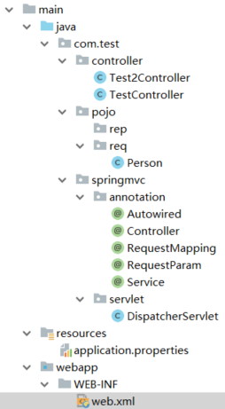

# 本文讲述了基于HttpServlet实现的springmvc
### 简介：使用HttpServlet实现简单springmvc，难点其实在于对注解理解，并将注解扫描的东西放入一些数据结构里，便于拿去，最后利用反射，去执行类的方法
### 整体项目结构：

### 代码实现：
##### 1.注解：
```
/**
 * @author 老肥猪
 * @since 2019/2/28
 * msg:
 */
@Target(ElementType.TYPE)
@Retention(RetentionPolicy.RUNTIME)
public @interface Controller {
    String value() default "";
}
```
```
/**
 * @author 老肥猪
 * @since 2019/2/28
 * msg:
 */
@Target({ElementType.METHOD,ElementType.TYPE})
@Retention(RetentionPolicy.RUNTIME)
public @interface RequestMapping {
    String value() default "";
}
```
```
/**
 * @author 老肥猪
 * @since 2019/2/28
 * msg:
 */
@Target(ElementType.PARAMETER)
@Retention(RetentionPolicy.RUNTIME)
public @interface RequestParam {
    String value() default "";
}
```
##### 2.配置文件application.properties
```
basePackage=com.test.controller
```
##### 3.web.xml文件
```
<?xml version="1.0" encoding="UTF-8" ?>
<web-app xmlns:xsi="http://www.w3.org/2001/XMLSchema-instance" xmlns="http://java.sun.com/xml/ns/javaee" xsi:schemaLocation="http://java.sun.com/xml/ns/javaee http://java.sun.com/xml/ns/javaee/web-app_2_5.xsd" id="WebApp_ID" version="2.5">
    <servlet>
        <servlet-name>dispatcherServlet</servlet-name>
        <servlet-class>com.test.springmvc.servlet.DispatcherServlet</servlet-class>
    </servlet>
    <servlet-mapping>
        <servlet-name>dispatcherServlet</servlet-name>
        <url-pattern>/*</url-pattern>
    </servlet-mapping>
</web-app>
```
##### 4.Servlet实现
```
/**
 * @author 老肥猪
 * @since 2019/2/28
 * msg:
 */
public class DispatcherServlet extends HttpServlet {

    private static final long serialVersionUID = 1378531571714153483L;
    /**
     * 配置文件
     */
    private static final Properties properties = new Properties();
    /**
     * 类列表
     */
    private static final List<String> clazzList = new ArrayList<String>();
    /**
     * 实例化map，有多少个controller
     */
    private static final Map<String, Object> instanceMap = new HashMap<String, Object>();
    /**
     * 方法执行器map
     */
    private static final Map<String, Method> handlerMappingMap = new HashMap<String, Method>();
    /**
     * reqmapping对应的controller
     */
    private static final Map<String, Object> ins = new HashMap<String, Object>();
    private static String baseUrl = "";

    @Override
    public void init() throws ServletException {
        System.out.println("init begin ...");
        /**
         * 加载配置文件
         */
        doLoadProperties();
        /**
         * 扫描所有类
         */
        doScannerClazz();
        /**
         * 获得实例
         */
        doInstance();
        /**
         * 执行mapping
         */
        doHandlerMapping();
        System.out.println("end init ...");
    }

    @Override
    protected void doGet(HttpServletRequest req, HttpServletResponse resp) throws ServletException, IOException {
        this.doPost(req, resp);
    }

    @Override
    protected void doPost(HttpServletRequest req, HttpServletResponse rep) throws ServletException, IOException {
        String uri = req.getRequestURI();
        String contextPath = req.getContextPath();
        String url = uri.replace(contextPath, "");
        Method m = handlerMappingMap.get(url);
        if (m == null) {
            return;
        }
        //获取方法的参数列表
        /**
         * 获取所有对象的类别
         */
        Class<?>[] parameterTypes = m.getParameterTypes();
        /**
         * 接口参数
         */
        Map<String, String[]> parameterMap = req.getParameterMap();
        /**
         * 计算出没有resquestbody的参数长度
         */
//        Long length = parameterMap.values().stream().map(strings -> strings.length).collect(Collectors.counting());
        /**
         * 存放参数的数组
         */
        Object[] paramValues = new Object[parameterTypes.length];

        Parameter[] parameters = m.getParameters();
        for (final Parameter parameter : parameters) {
            System.out.println(parameter.getName() + ' ');
        }
        for (int i = 0; i < parameterTypes.length; i++) {
            String paramName = parameterTypes[i].getSimpleName();
            /**
             * 如果是req
             */
            if (paramName.equals("HttpServletRequest")) {
                paramValues[i] = req;
                continue;
            }
            /**
             * 如果是rep
             */
            if (paramName.equals("HttpServletResponse")) {
                paramValues[i] = rep;
                continue;
            }
            if (paramName.equals("String")) {
                String[] values = null;
                if (parameters[i].isAnnotationPresent(RequestParam.class)
                        &&parameters[i].getAnnotation(RequestParam.class).value()!=null) {
                    RequestParam requestParam = parameters[i].getAnnotation(RequestParam.class);
                    values = parameterMap.get(requestParam.value());
                } else {
                    values = parameterMap.get(parameters[i].getName());
                }
                if(values!=null) {
                    paramValues[i]=Arrays.toString(values)
                            .replaceAll("\\[", "").replaceAll("\\]", "")
                            .replaceAll(",s", ",");
                }
            }
        }
        Object o = ins.get(url);
        if (m != null) {
            try {
                m.invoke(o, paramValues);
            } catch (IllegalAccessException e) {
                e.printStackTrace();
                rep.getWriter().write("<h1>500..." + e.getLocalizedMessage() + "</h1>");
            } catch (InvocationTargetException e) {
                e.printStackTrace();
                rep.getWriter().write("<h1>500..." + e.getLocalizedMessage() + "</h1>");
            } catch (IllegalArgumentException e) {
                e.printStackTrace();
                rep.getWriter().write("<h1>500..." + e.getLocalizedMessage() + "</h1>");
            }
        } else {
            rep.getWriter().write("<h1>404 not found!</h1>");
        }
    }


    private void doHandlerMapping() {
        if (instanceMap.size() > 0) {
            for (Map.Entry<String, Object> entry : instanceMap.entrySet()) {
                Method[] methods = entry.getValue().getClass().getMethods();
                for (Method m : methods) {
                    if (m.isAnnotationPresent(RequestMapping.class)) {
                        RequestMapping annotation = m.getAnnotation(RequestMapping.class);
                        String defaultUrl = annotation.value();
                        String url = baseUrl + defaultUrl;
                        handlerMappingMap.put(url, m);
                        ins.put(url, entry.getValue());
                    }
                }
            }
            System.out.println(handlerMappingMap);
        }
    }

    private void doInstance() {
        if (clazzList != null && !clazzList.isEmpty()) {
            for (String clazzName : clazzList) {
                try {
                    Class<?> clazz = Class.forName(properties.getProperty("basePackage") + "." + clazzName);
                    if (clazz.isAnnotationPresent(Controller.class)) {
                        Object obj = clazz.newInstance();
                        Controller annotation = clazz.getAnnotation(Controller.class);
                        String val = annotation.value();
                        if (val == null || val.equals(""))
                            val = obj.getClass().getSimpleName();
                        instanceMap.put(val, obj);
                    }
                    if (clazz.isAnnotationPresent(RequestMapping.class)) {
                        Object obj = clazz.newInstance();
                        RequestMapping annotation = clazz.getAnnotation(RequestMapping.class);
                        String val = annotation.value();
                        if (val == null || val.equals(""))
                            val = "/" + obj.getClass().getSimpleName();
                        baseUrl = val;
                    }
                } catch (Exception e) {
                    e.printStackTrace();
                }
            }
        }
    }

    /**
     * 加载basePackage下的类
     */
    private void doScannerClazz() {
        if (properties != null) {
            String basePackage = properties.getProperty("basePackage");
            if (!basePackage.equals("") && basePackage.length() > 0) {
                basePackage = basePackage.replaceAll("\\.", "/");
                System.out.println("basePackage:" + basePackage);
                URL url = this.getClass().getClassLoader().getResource(basePackage);
                if (url != null) {
                    String path = url.getFile();
                    File file = new File(path);
                    String[] list = file.list();
                    for (String f : list) {
                        if (f.endsWith(".class")) {
                            clazzList.add(f.split("\\.")[0]);
                        }
                    }
                }
            }
        }
    }

    /**
     * 加载配置文件
     */
    private void doLoadProperties() {
        InputStream in = this.getClass().getClassLoader().getResourceAsStream("application.properties");
        try {
            properties.load(in);
        } catch (IOException e) {
            e.printStackTrace();
        }
    }

}
```
##### 4.测试
```
/**
 * @author 老肥猪
 * @since 2019/2/28
 * msg:
 */
@Controller
@RequestMapping("/test")
public class TestController {

    @RequestMapping("/hello")
    public String hello(HttpServletResponse response){
        try {
            response.getWriter().write("test hello");
        } catch (IOException e) {
            e.printStackTrace();
        }
        return "";
    }
    @RequestMapping("/hello2")
    public String hello2(HttpServletResponse response, @RequestParam String name,@RequestParam String age){
        try {
            response.getWriter().write("hello "+name+",your age is "+age);
        } catch (IOException e) {
            e.printStackTrace();
        }
        return "";
    }
}
```
### 总结：
我们使用了接近200行的代码实现了springmvc的三个注解，还有一些注解没有想到更好的实现的方法，暂时现不实现。