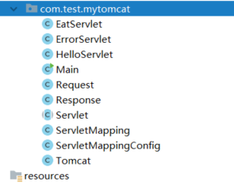
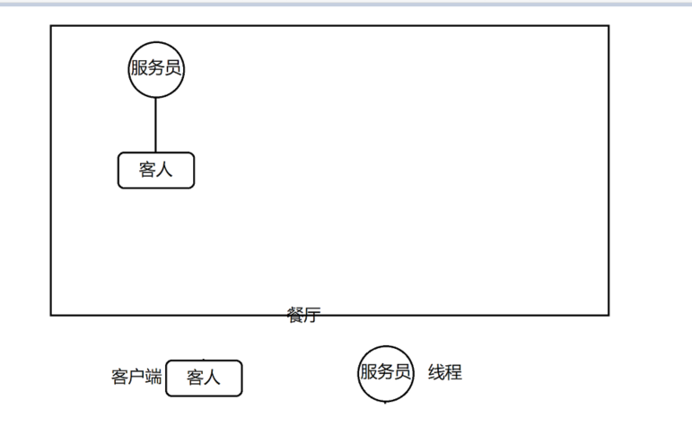
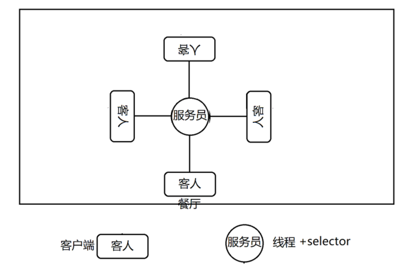

# 简单tomcat实现解析
### 简介：
##### 1.建立通讯
使用socket提供tomcat与前端交互的通信服务
##### 2.分发请求
将不同请求分发给不同的web服务
##### 3.将请求和响应进行封装
将请求进行处理并封装成request对象，将repsonse对象进行解析成前端熟悉的样式
### 工程目录结构

### 代码结构
##### 1.Request类
```
/**
 * @author 老肥猪
 * @since 2019/3/6
 */
@Getter
@Setter
public class Request {  
    private String method;  
    private String url;  

    public Request(InputStream inputStream) {
        byte[] bytes = new byte[1024];
        int length=0;
        String httpRequestString = null;
        try {
            if ((length=inputStream.read(bytes))>0) {
                httpRequestString=new String(bytes,0,length);
            }
        } catch (IOException e) {
            e.printStackTrace();
        } 
        if(httpRequestString==null) {
            return;
        }
        //        POST /test/hello HTTP/1.1
        String http = httpRequestString.split("\n")[0];
        this.method = http.split("\\s")[0];
        this.url = http.split("\\s")[1];
        System.out.println("\n"+httpRequestString);
    }
}
```
##### 2.Repsonse类
```
/**
 * @author 老肥猪
 * @since 2019/3/6
 */
@Getter
@Setter
public class Response {

    private OutputStream outputStream;

    public Response(OutputStream outputStream) {
        this.outputStream = outputStream;
    }

    public void write(String content) {
        StringBuffer response=new StringBuffer();
//        HTTP/1.1 200 OK
//        Content-Type: text/html
        response.append("HTTP/1.1 200 OK\n")
                .append("Content-Type: text/html\n")
                .append("\r\n")
                .append("<html><body>")
                .append(content)
                .append("</body></html>");
        try {
            outputStream.write(response.toString().getBytes());
        } catch (IOException e) {
            e.printStackTrace();
        } finally {
            try {
                if(outputStream!=null) {
                    outputStream.close();
                }

            } catch (IOException e) {
                e.printStackTrace();
            }
        }
    }
}
```
##### 3. ServletMapping servlet关系类（通过这个类得知servlet的url和对应类的关系），servlet是用xml配置实现，这里就不适用xml读取了
```
/**
 * @author 老肥猪
 * @since 2019/3/6
 */
@Getter
@Setter
public class  ServletMapping {
    private String url;
    private String clazz;
    private String name;
    public ServletMapping(String url, String clazz, String name) {
        this.url = url;
        this.clazz = clazz;
        this.name = name;
    }

}
```
##### 4.这个类将servlet的关系初始化
```
/**
 * @author 老肥猪
 * @since 2019/3/6
 */
public class ServletMappingConfig {
    private static List<ServletMapping> mappingList=new ArrayList<>();

    static {
        mappingList.add(new ServletMapping("/test/eat","com.test.mytomcat.EatServlet","eat-mapping"));
        mappingList.add(new ServletMapping("/test/hello","com.test.mytomcat.HelloServlet","hello-mapping"));
    }

    public static List<ServletMapping> getMappingList() {
        return mappingList;
    }
}
```
##### 5.Servlet抽象类
```
/**
 * @author 老肥猪
 * @since 2019/3/6
 */
public abstract class Servlet {
    public abstract void doGet(Request request,Response response);
    public abstract void doPost(Request request,Response response);

    /**
     * 请求分发
     * @param request
     * @param response
     */
    public void service(Request request,Response response) {
        System.out.println(request);
        if("GET".equals(request.getMethod())) {
            this.doGet(request,response);
        } else {
            this.doPost(request,response);
        }
    }
}
```
##### 6.Servlet实现类
```
/**
 * @author 老肥猪
 * @since 2019/3/6
 */
public class EatServlet extends Servlet {

    @Override
    public void doGet(Request request, Response response) {
        response.write("<h1>我在吃饭！ get</h1>");
    }

    @Override
    public void doPost(Request request, Response response) {
        response.write("<h1>我在吃饭！ post</h1>");
    }
}
```
```
/**
 * @author 老肥猪
 * @since 2019/3/6
 */
public class ErrorServlet extends Servlet {


    @Override
    public void doGet(Request request, Response response) {
        this.doPost(request,response);
    }

    @Override
    public void doPost(Request request, Response response) {
        response.write("<center><h1>404</h1></center>");
    }
}
```
```
/**
 * @author 老肥猪
 * @since 2019/3/6
 */
public class HelloServlet extends Servlet {
    @Override
    public void doGet(Request request, Response response) {
        response.write("<h1>Hello world! get</h1>");
    }

    @Override
    public void doPost(Request request, Response response) {
        response.write("<h1>Hello world! post</h1>");
    }
}
```
##### 7. tomcat容器初始化并做请求的分发
```
/**
 * @author 老肥猪
 * @since 2019/3/6
 */
public class Tomcat {

    private Integer port=8080;

    public Tomcat(Integer port) {
        this.port = port;
    }

    public Tomcat() {
    }

    private static Map<String,String> urlMap=new HashMap<>();
    private void initUrlMap() {
        List<ServletMapping> mappingList = ServletMappingConfig.getMappingList();
        urlMap=mappingList.stream().collect(Collectors.toMap(k->k.getUrl(),v->v.getClazz()));
    }

    public void start() {
        System.out.println("tomcat启动了");
        initUrlMap();
        ServerSocket serverSocket=null;
        try {
            serverSocket =new ServerSocket(port);
            for (;;) {
                Socket socket = serverSocket.accept();
                InputStream inputStream = socket.getInputStream();
                OutputStream outputStream = socket.getOutputStream();
                Request request = new Request(inputStream);
                Response response = new Response(outputStream);
                distribute(request,response);
                socket.close();
            }
        } catch (IOException e) {
            e.printStackTrace();
        } finally {
            try {
                if(serverSocket != null) {
                    System.out.println("tomcat关闭了");
                    serverSocket.close();
                }
            } catch (IOException e) {
                e.printStackTrace();
            }
        }
    }

    /**
     * 分发请求
     * @param request
     * @param response
     */
    private void distribute(Request request, Response response) {
        String url = request.getUrl();
        String clazz = urlMap.get(url);
        Servlet servlet = null;
        if(clazz==null || "".equals(clazz)) {
            servlet=new ErrorServlet();
        } else {
            try {
                Class<Servlet> aClass = (Class<Servlet>)Class.forName(clazz);
                servlet =  aClass.newInstance();
//                System.out.println(aClass);
            } catch (ClassNotFoundException e) {
                e.printStackTrace();
            } catch (InstantiationException e) {
                e.printStackTrace();
            } catch (IllegalAccessException e) {
                e.printStackTrace();
            }
        }
        servlet.service(request,response);
    }


}
```
##### 8. 启动测试
```
/**
 * @author 老肥猪
 * @since 2019/3/6
 */
public class Main {
    public static void main(String[] args) {
        new Tomcat().start();
    }
}
```
### 总结
就这样我们仅用了短短200行左右的代码就实现了一个简单的tomcat，虽然在很多方面我们都没有考虑到，比如使用socket的问题，我们得知道socket建立得通讯时一对一的，这就会导致用户量的会被阻塞，见下图：   
   
这是我们当前的架构，只有一个服务员，提供一个服务，也就是如果客人（客服端）没有结束服务，就会导致服务端一直处于服务之中，如果下一个客人（客户端）来后，就会阻塞等待。   
既然这样我们自然的就会想到多线程，如下图：
   
但毕竟线程的有局限性，如果一个服务员就只对一个客人服务，导致如果客人增加，毕然会导致系统的不稳定。这是我们应该想到，如果一个服务员可以同时2服务多个客人的话，这样不就可以解决这样的阻塞问题。   
这是一个新的东西出现了，也就nio，我们可以利用nio做到这些，因为nio不像socket的io是阻塞的，所以可以做到一个服务员服务多个客人，如下图：   

这样就可以使我们的系统容纳的人变的更多了。   
但是这样必然也会有些小问题，毕竟现在只是单线程而已，而人流量的扩展也会导致服务提供慢的问题，如果我们能改进nio，使ta变成一多线程模型，是否会更好？这里就不多讲了，等下次netty会讲到，以及自己实现nio多线程。